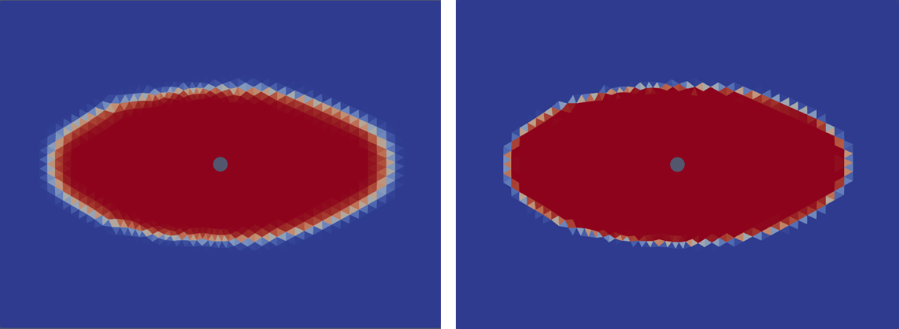

# lcmFoam24

The lcmFoam solver has the functionalities of the porousSimpleFoam and interFoam (MULES method for the VOF equation is currently commented out; in the standard version the VOF equation is solved directly) solvers integrated into it and so is able to simulate incompressible, two-phase fluid flow through a porous medium under isothermal conditions. So, since lcmFoam incorporates the porosity of the medium, the momentum equation solved will contain an additional source term which is absent in the previous solvers.

The way the lcmFoam solver simulates the flow process during liquid composite molding processes is that it considers the flow phenomenon to be a two-phase flow within a porous medium, which represents the fibre system. The two phases included are resin and air. When the resin is injected, the air is pushed out through the vents and the resin fills the space previously occupied by the air. Thus, the conservation of mass and momentum are solved along with the volume-of-fluid method based phase fraction equation

## Installation (for OpenFoam v2406 on Ubuntu operating systems)

- Install OpenFOAM, for example from https://develop.openfoam.com/Development/openfoam/-/wikis/precompiled/debian 
- Download the zipped lcmFoam24 code.
- Create a folder (for example myOpenFOAM in your home directory) for your custom OpenFoam applications/solvers and cases. Extract the zipped lcmFoam24 code there. 
- Change directory to applications/solvers/lcmFoam24 and open a terminal there and execute "openfoam2406". Execute "wclean; wmake".
- Change directory to cases/DM_radialflow_4cells and open a terminal there and execute "openfoam2406". Execute "lcmFoam24".

## Comparison lcmFoam24 without and with MULES solver for the vOF equation

